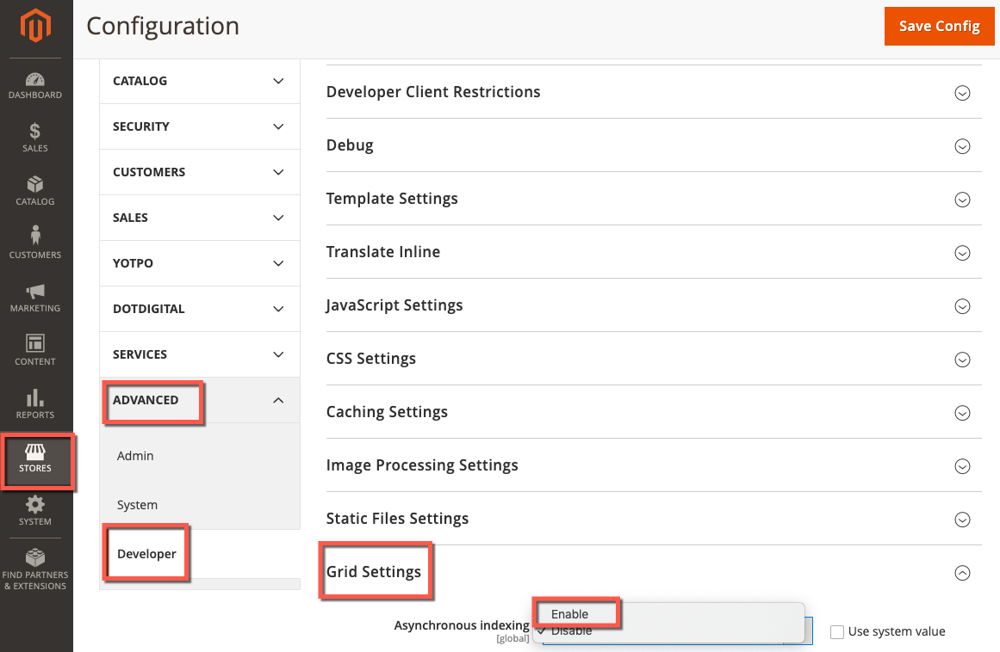

This article provides best practice for configuration settings that can help improve checkout performance in case of large number of simultaneously created orders.

## Affected products and versions

* Magento Commerce Cloud, all [supported versions](https://magento.com/sites/default/files/magento-software-lifecycle-policy.pdf)
* Magento Commerce, all [supported versions](https://magento.com/sites/default/files/magento-software-lifecycle-policy.pdf)

## Best practice

If the number of simultaneously placed orders in your store is large enough and has a negative impact on checkout performance, we recommend enabling asynchronous orders processing.

To enable the setting:

1. Run `php bin/magento config:set dev/grid/async_indexing 1`.
    Non Cloud users can alternatively enable the **Asynchronous indexing** option in Magento Admin under **Stores** > Settings > **Configuration** > **Advanced** > **Developer** > **Grid Settings** > **Asynchronous indexing**.
1. Flush cache by running `php bin/magento cache:flush` or go to Magento Admin under **System** > **Tools** > **Cache Management**.

>![warning]
>
>Warning: always test in the Staging environment prior to making any changes to the Production environment.

## Related reading

* [Best practice Magento order placement performance](https://support.magento.com/hc/en-us/articles/360048170772)
* [Configuration paths reference in Magento Developer Documentation](https://devdocs.magento.com/guides/v2.4/config-guide/prod/config-reference-most.html)
