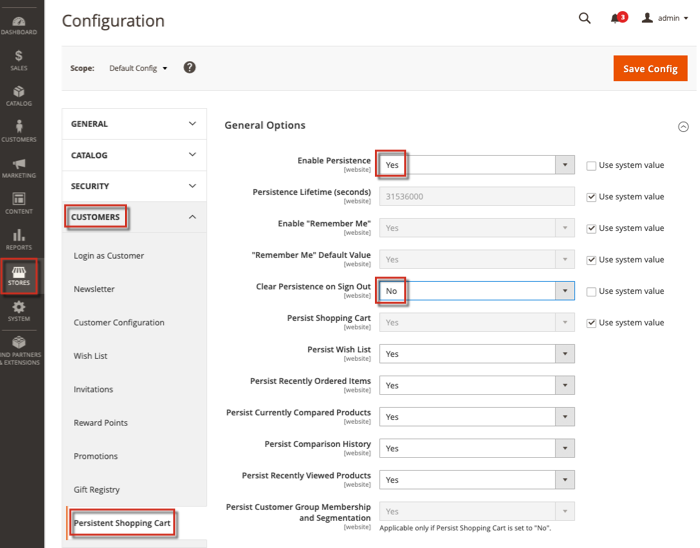

The MDVA-34023 Magento patch solves the issue where `No such entity with addressId` errors occur randomly on a customer's web browser.

This patch is available when the [Magento Quality Patch (MQP) tool](https://devdocs.magento.com/guides/v2.4/comp-mgr/patching.html#mqp) 1.0.15 is installed. Please note that the issue is scheduled to be fixed in Magento version 2.4.3.

## Affected products and versions

 **The patch is created for Magento version:** Magento Commerce Cloud 2.3.1

 **Compatible with Magento versions:** Magento Commerce Cloud and Magento Commerce 2.3.0 - 2.4.2

>![info]
>
>Note: the patch might become applicable to other versions with new MQP tool releases. To check if the patch is compatible with your Magento version, run `./vendor/bin/magento-patches status` .

## Issue

 <span class="wysiwyg-underline">Steps to reproduce</span> :

1. Go to **Stores** > **Settings** > **Configuration** > **Customers tab** > **Persistent shopping cart** .
1. Set **Enable Persistence** = *Yes* , set **Clear Persistence on Sign Out** = *No* .        
1. Create a new customer, and define the default shipping and billing addresses.
1. Log out.
1. Log in with the **Remember me** checkbox selected.
1. Go to the `customer_entity` DB table and change the `default_billing` and `default_shipping` IDs to non-existing ones.
1. Log out.

 <span class="wysiwyg-underline">Expected results</span> :

No errors appear, as expected.

 <span class="wysiwyg-underline">Actual results</span> :

The exception log is generated:

```php
Exception.log:
{"0":"No such entity with addressId = XXXXX","1":"#0 /vendor\/magento\/module-customer\/Model\/AddressRegistry.php(49): Magento\\Framework
Exception
NoSuchEntityException::singleField('addressId', 'XXXXX')
```

 
## Apply the patch

To apply individual patches use the following links depending on your Magento product:

* Magento Commerce: DevDocs [Software Update Guide > Apply Patches](https://devdocs.magento.com/guides/v2.4/comp-mgr/patching.html) .
* Magento Commerce Cloud: DevDocs [Upgrades and Patches > Apply Patches](https://devdocs.magento.com/cloud/project/project-patch.html) .

## Related reading

To learn more about Magento Quality Patches, refer to:

* [Magento Quality Patches released: a new tool to self-serve quality patches](https://support.magento.com/hc/en-us/articles/360047139492) .
* [Check patch for Magento issue with Magento Quality Patches](https://support.magento.com/hc/en-us/articles/360047125252) .

For info about other patches available in MQP tool, refer to the [Patches available in MQP tool](https://support.magento.com/hc/en-us/sections/360010506631-Patches-available-in-MQP-tool-) section.
