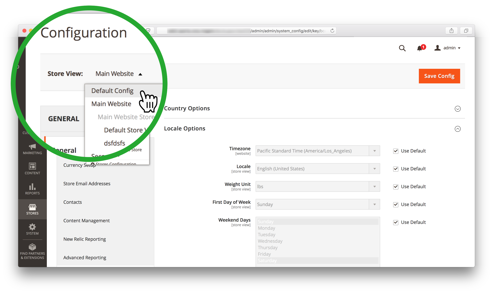

>![warning]
>
> [MySQL catalog search engine will be removed in Magento 2.4.0](https://support.magento.com/hc/en-us/articles/360043144271-MySQL-catalog-search-engine-will-be-removed-in-all-versions-of-Magento-2-4-0) . You must have Elasticsearch host setup and configured prior to installing version 2.4.0. Refer to [Install and configure Elasticsearch](https://devdocs.magento.com/guides/v2.3/config-guide/elasticsearch/es-overview.html) .

This article provides a solution for changing the Magento Search Engine using the Magento Admin if the **Search Engine** field is not displayed or the **Use system value** checkbox is greyed out and not accessible.

In this article:

* [Affected versions](#affected-versions)
* [Change Search Engine using Magento Admin (steps)](#change-search-engine-using-magento-admin-steps)
* [Issues with Magento Commerce (On-Premise)](#magento-commerce-on-premise)
* [Magento Commerce (Cloud)](#magento-commerce-cloud)

<h2 id="affected-versions">Affected versions</h2>

* Magento Commerce (On-Premise): 2.X.X
* Magento Commerce (Cloud):
    * Version: 2.X.X
    * Plan: Starter, Pro
* MySQL, Elasticsearch: all supported versions

<h2 id="change-search-engine-using-magento-admin-steps">Change Search Engine using Magento Admin (steps)</h2>

1. Log in to Magento Admin as an Administrator.
1. On the left-side Admin sidebar, click **Stores** . Then, under **Settings** , choose **Configuration** .
1. In the panel on the left under **Catalog,** choose **Catalog** .
1. Expand the **Catalog Search** section.        
1. Go to the **Search Engine** field and remove selection from the **Use system value** checkbox.
1. Click the **Search Engine** menu and select one of the available options.        
1. Click **Save Config** in the top-right corner of the page.

<h2 id="magento-commerce-on-premise">Issues with Magento Commerce (On-Premise)</h2>

### Issue 1: Search Engine field is not displayed

When you access the **Catalog Search** section, the **Search Engine** menu is not displayed at all.


### Cause: Store View is not Default Config

The Store View for Magento Admin has been set to any value other than *Default Config* .

The search engine is a global configuration set on the application level, not on the Store Scope. Stores within a Magento application cannot use different search engines.

### Solution: Set Store View to Default Config

1. Log in to Magento Admin as an Administrator.
1. On the left-side Admin sidebar, click **Stores** . Then, under **Settings** , choose **Configuration** .
1. In the upper-left corner, click the **Store View** selector and choose *Default Config* .
1. Click **OK** in the confirmation dialog to approve store view change.



 **Related documentation:**   [Changing Scope](http://docs.magento.com/m2/ee/user_guide/configuration/scope-change.html) (Magento User Guide).

### Issue 2: Cannot uncheck "Use system value"

When you access the **Catalog Search** section of Magento Admin, the **Use system value** checkbox is greyed out so you cannot remove selection from the checkbox to later change the search engine.

### Cause

The default search engine has been configured on the application configuration level in the `app/etc/env.php` or `app/etc/config.php` files and thus cannot be changed using Magento Admin.

Example of the section with default search engine configuration:

```php
'system'=>
array (
'default'=>
array (
'catalog'=>
array (
'search'=>
array (
'engine'=>'mysql',
),
),
),
),
```

### Solution

Remove the section with default search engine configuration from the `app/etc/env.php` or the `app/etc/config.php` configuration files.

### Related documentation on DevDocs

 [Magento configuration files](https://devdocs.magento.com/guides/v2.2/config-guide/config/config-magento.html) (Magento Configuration Guide)

<h2 id="magento-commerce-cloud">Magento Commerce (Cloud)</h2>

Switching search engines using Magento Admin is not available in Magento Commerce (Cloud) due to the way the Cloud infrastructure has been organized.

During the deployment process, the Magento Cloud deployment scripts check if Elasticsearch has been declared in the `MAGENTO_CLOUD_RELATIONSHIPS` variable. If declared, Elasticsearch is selected as the active search engine and configured automatically; the [MySQL search engine](https://support.magento.com/hc/en-us/articles/360043144271-MySQL-catalog-search-engine-will-be-removed-in-Magento-2-4-0) becomes inaccessible in Magento Admin. If the Elasticsearch relationship has not been declared, MySQL is set to active, and Elasticsearch becomes inaccessible.

It is not recommended to edit the `app/etc/env.php` or the `app/etc/config.php` configuration files directly on your Cloud environment, that is why changing these files to make the Elasticsearch engine to be displayed in Magento Admin (the solution we recommend in the previous section) is not applicable for your Cloud project.

### Change search engine on Staging and Production environments

Before switching search engine from MySQL to Elasticsearch on your Staging and Production environments, make sure you have previously [submitted a support ticket](https://support.magento.com/hc/en-us/articles/360019088251) requesting to enable Elasticsearch on the environment and the ticket has been resolved successfully.

To change the search engine used on your Staging and Production environments, change the `SEARCH_CONFIGURATION` environment variable in your `.magento.env.yaml` file on your local environment, then push changes to the Integration and Staging/Production environments for the changes to take effect.

If you switch from MySQL to Elasticsearch, the SEARCH\_CONFIGURATION variable in the resulting `.magento.env.yaml` file might look as follows:

```yaml
stage:
  deploy:
   SEARCH_CONFIGURATION:
     engine: elasticsearch
     elasticsearch_server_hostname: hostname
     elasticsearch_server_port: '123456'
     elasticsearch_index_prefix: magento
     elasticsearch_server_timeout: '15'
```

### Related documentation

#### Knowledge Base

* [Enable Elasticsearch on Cloud](https://support.magento.com/hc/en-us/articles/115004905874)

#### DevDocs

* [Set up Elasticsearch service](http://devdocs.magento.com/guides/v2.2/cloud/project/project-conf-files_services-elastic.html)
* [Build and deploy](http://devdocs.magento.com/guides/v2.2/cloud/project/magento-env-yaml.html) (documentation about the `.magento.env.yaml` configuration file)
* [Deploy variables](https://devdocs.magento.com/guides/v2.2/cloud/env/variables-deploy.html) ( [SEARCH\_CONFIGURATION section](https://devdocs.magento.com/guides/v2.2/cloud/env/variables-deploy.html#searchconfiguration) )
* [Services](http://devdocs.magento.com/guides/v2.2/cloud/project/project-conf-files_services.html) (documentation about the `.magento/services.yaml` configuration file)

