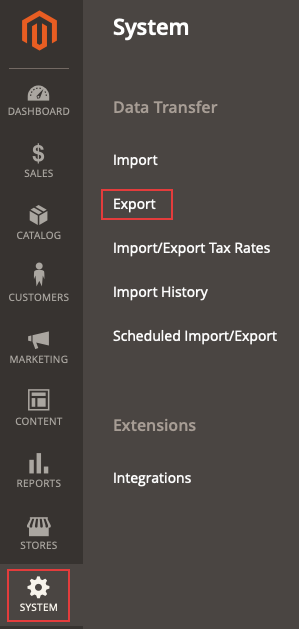

This article provides a fix for the issue where you try to export products to a .csv file in Magento Admin, but the file does not appear.

## Affected products and versions

* Magento Commerce Cloud 2.3.2

## Issue

 <span class="wysiwyg-underline">Steps to reproduce</span>

Prerequisites: The **Add Secret Key to URLs** option is set to *Yes* . The option is configured in the Magento Admin under **Stores** > **Configuration** > **Advanced** > **Admin** > **Security** .

1. In the Magento Admin, navigate to **System** > **Data Transfer** > **Export** .    
        
1. Select
    * **Entity Type** : *Products*
    * **Export File Format** : *CSV*
    * **Field Enclosure** : leave unchecked.
1. Click **Continue** .
1. The following message is displayed: *"Message is added to queue, wait to get your file soon"* .

 <span class="wysiwyg-underline">Expected result</span>

The .csv file with the exported products is displayed in the grid in a couple of minutes.

 <span class="wysiwyg-underline">Actual result</span>

The .csv file with the exported products is not displayed in the grid in 10 minutes or more.

## Cause

A known issue with the Export functionality in Magento application part version 2.3.2.

## Solution

There are two possible solutions for the issue:

* Disable the Add Secret Key to URL option.
* Run the the `bin/magento queue:consumers:start exportProcessor` command manually, and optionally configure it to be run by cron.

See details for both options in the following paragraphs.

### Disable the the Add Secret Key to URL option

1. In the Magento Admin, navigate to **Stores** > **Configuration** > **Advanced** > **Admin** > **Security** .
1. Set the **Add Secret Key to URLs** option to *No.*
1. Click **Save Config** .
1. Clean cache under **System** > **Tools** > **Cache Management** or by running    ```bash    bin/magento cache:clean    ```    or in Magento Admin.

### Run the export command manually and optionally add it as cron job

To get the export file, run the `bin/magento queue:consumers:start exportProcessor` command. After running this, the file should be displayed in the grid.


To add the process as a cron job optionally, you must add the `CRON_CONSUMERS` variable to the `.magento.env.yaml` file.

#### Add process as a cron job (optional)

1. Make sure your cron is setup and configured. See [Set up cron jobs](https://devdocs.magento.com/guides/v2.3/cloud/configure/setup-cron-jobs.html) for details.
1. Run the following command to return a list of message queue consumers:     `./bin/magento queue:consumers:list`     
1. Add the following to your `.magento.env.yaml` file in the Magento `/app` directory, and include the consumers you would like to add. For example, here is the consumer required for export processing:
   ```yaml
   stage:
       deploy:
           CRON_CONSUMERS_RUNNER:
               cron_run: true
               max_messages: 1000
               consumers:
                   - exportProcessor
   ```
   Then push this updated file and redeploy your environment. Also reference [Add custom cron jobs to your project](https://devdocs.magento.com/cloud/configure/setup-cron-jobs.html#add-cron).

>![info]
>
>If you cannot find the `.magento.env.yaml` file for your environment, and you think it was deleted, you need to create a new `.magento.env.yaml` . It might be empty initially, you can add info there as required. Reference the following Magento DevDocs articles: [Build and deploy](https://devdocs.magento.com/cloud/project/magento-env-yaml.html) , [Environment variables](https://devdocs.magento.com/cloud/env/variables-intro.html)

>![info]
>
>On Magento Commerce Pro projects, the [auto-crons feature](https://devdocs.magento.com/guides/v2.3/cloud/configure/setup-cron-jobs.html#verify-cron-configuration-on-pro-projects) must be enabled on your Magento Commerce Cloud project before you can add custom cron jobs to Staging and Production environments using `.magento.app.yaml` . If this feature is not enabled, [create a support ticket](https://support.magento.com/hc/en-us/articles/360019088251-Submit-a-support-ticket) , to have the job added for you.
