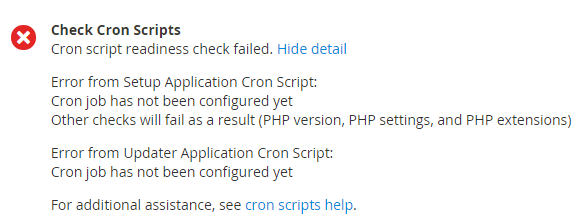

This article describes troubleshooting solutions for issues with cron in Magento on-premise products.

Affected products and versions

* Magento Commerce 2.2.x, 2.3.x
* Magento Open Source 2.2.x, 2.3.x

## Issues

## Following are symptoms of cron issues:

* Your update or upgrade never runs; it stays in a `pending` state.
* An error message about the [PHP](https://glossary.magento.com/php) setting `$HTTP_RAW_POST_DATA` displays even though it's set properly.
* The cron readiness check fails. Possible errors include non-writable paths and cron not set up. An example follows:        
* The PHP readiness check doesn't display the PHP version as the following figure shows.        
* The following error displays in the Magento Admin:        To see the error, you might need to click **System Messages** at the top of the window as follows:        

<h2 id="check-your-existing-crontab">Investigate to find the cause</h2>

This section discusses how to see if cron is currently running and to verify whether it's set up properly.

To verify whether or not your crontab is set up:

1. Log in to your Magento server as, or switch to, the [Magento file system owner](https://devdocs.magento.com/guides/v2.3/install-gde/prereq/file-sys-perms-over.html) .
1. See if the following file exists:    ```bash    ls -al <magento_root>/var/.setup_cronjob_status    ```    If the file exists, cron has run successfully in the past. If the file *does not* exist, either you haven't yet installed Magento or cron isn't running. In either case, continue with the next step.    
1. Get more detail about cron.    As a user with `root` privileges, enter the following command:    ```bash    crontab -u <Magento file system owner name> -l    ```    For example, on CentOS    ```bash    crontab -u magento_user -l    ```    If no crontab has been set up for the user, the following message displays:    ```terminal    no crontab for magento_user    ```    Your crontab tells you the following:    
    * What PHP binary you're using (in some cases, you have more than one)
    * What Magento cron scripts you're running (in particular, the paths to those scripts)
    * Where your cron logs are located
See one of the following sections for a solution to your issue.    

## Solutions

<h3 id="solution-crontab-not-set-up">Solution for crontab not being set up</h3>

To verify your cron jobs are set up properly, see [Set up cron jobs](https://devdocs.magento.com/guides/v2.3/install-gde/install/post-install-config.html#post-install-cron) .

<h3 id="solution-cron-running-from-incorrect-php-binary">Solution for cron running from incorrect PHP binary</h3>

If your cron job uses a PHP binary different from the web server plug-in, PHP settings errors might display. To resolve the issue, set identical PHP settings for both the PHP command line and the PHP web server plug-in.

For more information about PHP settings, see [Required PHP settings](https://devdocs.magento.com/guides/v2.3/install-gde/prereq/php-settings.html) .

<h3 id="solution-cron-running-with-errors">Solution for cron running with errors</h3>

Try running each command manually because the command might display helpful error messages. See [Set up cron jobs](https://devdocs.magento.com/guides/v2.3/install-gde/install/post-install-config.html#post-install-cron) .

>![info]
>
>You must run cron at least *twice* for the job to execute; the first time to queue jobs, the second time to execute the jobs.