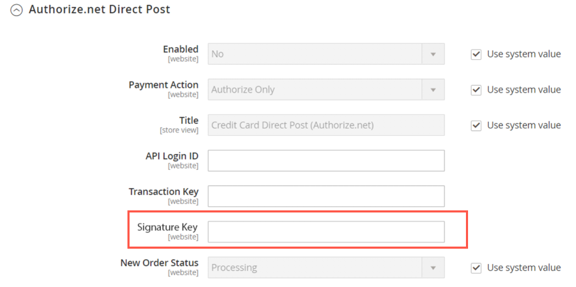

UPDATED on April 12th, 2019

Adobe Commerce implementation of the Authorize.Net Direct Post payment method uses MD5 based hash. Authorize.net will [stop supporting MD5 based hash](https://support.authorize.net/s/article/MD5-Hash-End-of-Life-Signature-Key-Replacement) usage on [June 28, 2019](http://app.payment.authorize.net/e/es.aspx?s=986383348&e=1691349&elqTrackId=b307147cf4ef4925bd108180234867d4&elq=22c763e5e2354d988ebfea2681020c6b&elqaid=903&elqat=1). This will result in Adobe Commerce merchants not being able to process payments using Authorize.Net Direct Post. To avoid this, merchants need to apply the patch provided by Adobe Commerce and replace the existing MD5 hash with a Signature Key (SHA-512) in the Commerce Admin configuration settings.

>![info]
>
>Adobe Commerce released a new Authorize.Net extension to replace Direct Post in upcoming 2019 releases, starting with v2.3.1 for Adobe Commerce and Open Source.

>![info]
>
>The core Adobe Commerce Authorize.Net payment integration is deprecated since 2.3.4 and will be completely removed in 2.4.0. Use the [official extension](https://marketplace.magento.com/authorizenet-magento-module-authorizenet.html) from Commerce Marketplace instead.

### Affected versions

* Adobe Commerce 1.X.X
* Magento Open Source 1.X.X
* Adobe Commerce 2.X.X
* Magento Open Source 2.X.X
* Adobe Commerce on cloud infrastructure 2.X.X
* Authorize.Net Direct Post

## Issue

Adobe Commerce implements the Authorize.Net Direct Post payment method, using Authorize.Net's AIM (Advanced Integration Method) and DPM (Direct Post method) APIs, which use MD5 based hash.

 [Authorize.net will stop supporting MD5 based hash usage on March 14, 2019](https://support.authorize.net/s/article/MD5-Hash-End-of-Life-Signature-Key-Replacement). Starting from this date, Magento Open Source, Adobe Commerce and Adobe Commerce on cloud infrastructure merchants will not be able to process payments using Authorize.Net Direct Post payment method. To be able to continue successfully process payments using these methods, merchants need to apply the patch provided by Adobe Commerce and replace the existing MD5 hash with a Signature Key in the Commerce Admin configuration settings.

## Solution

Further are described the three general steps you need to take be able to continue using Authorize.Net Direct Post payment method.

Alternatively, you can upgrade to version 2.2.8 or 2.3.1 and get all updates and a [new Authorize.net payment method option](https://docs.magento.com/m2/ce/user_guide/payment/authorize-net.html).

### 1. Download the patch

#### Adobe Commerce on cloud infrastructure and Adobe Commerce

Patches are attached to this article. To download a patch, scroll down to the end of the article and click the file name, or click one the following links:

* For versions 2.2.0-2.2.7 and 2.3.0 - [Download Auth.net.md5-2019-02-28-05-04-05.composer-2019-03-04-07-33-26.patch](assets/Auth.net.md5-2019-02-28-05-04-05.composer-2019-03-04-07-33-26.patch.zip)
* For versions 2.0.0-2.0.18 and 2.1.0-2.1.16 - [Download MDVA-17212\_EE\_2.1.0\_v1.composer-2019-03-05-12-05-22.patch](assets/MDVA-17212_EE_2.1.0_v1.composer-2019-03-05-12-05-22.patch.zip)

#### Adobe Commerce

* For versions 1.10.1.0-1.14.4.1 - [Download PATCH\_SUPEE-11085\_EE\_1.14.4.0\_v1-2019-02-28-04-59-38.sh](assets/PATCH_SUPEE-11085_EE_1.14.4.0_v1-2019-02-28-04-59-38.sh.zip)

#### Magento Open Source

1. Click a link to download: [M1 patch](https://magento.com/tech-resources/download#download2280) or [M2 patch](https://magento.com/tech-resources/download#download2279).
1. For Select your format, select a format best matching your needs. For M1, there is just one option. For M2, choose between Git-based or Composer-based.

### 2. Apply the patch

You may require developer assistance to apply the update. To update, you can download and install packages for your Adobe Commerce edition and version. Download patches also available for those who installed with Composer.

#### Adobe Commerce on cloud infrastructure

For Adobe Commerce on cloud infrastructure, apply the M2 patch and deploy. For details, see [Apply custom patches](https://devdocs.magento.com/guides/v2.3/cloud/project/project-patch.html).

#### Magento 2.X Commerce

For Adobe Commerce 2.X and Open Source 2.X, follow these steps to install the Composer-based patch:

1. Upload the patch to your Magento root directory.
1. Run the following SSH command:    ```git    patch -p1 < %patch_name%    ```    (If the above command does not work, try using `-p2` instead of `-p1` )
1. For the changes to be reflected, refresh the cache in the Commerce Admin under **System** > **Cache Management**.

#### Magento 2.X Open Source

For Magento Open Source 2.X, follow these steps to install the Composer-based patch:

1. Upload the patch to your Magento root directory.
1. Run the following SSH command:    ```git    patch -p0 < %patch_name%    ```    
1. For the changes to be reflected, refresh the cache in the Admin under **System** > **Cache Management**.

#### Adobe 1.X Commerce and Magento Open Source

For Adobe Commerce 1.X and Open Source 1.X, follow these steps to install the patch:

1. Upload the patch to your Magento root directory.
1. Run the following SSH command:    ```bash    sh %patch_name%.sh    ```    
1. For the changes to be reflected, refresh the cache in the Admin under **System** > **Cache Management**.

### 3. Get a new Signature Key

You need to get a new Signature Key and add it to your Commerce Admin configuration. For more information, see [What is a Signature Key?](https://support.authorize.net/s/article/What-is-a-Signature-Key)

1. Log into the Merchant Interface at [https://account.authorize.net](https://account.authorize.net/).
1. Click **Account** from the main toolbar.
1. Click **Settings** in the main left-side menu.
1. Click **API Credentials & Keys**.
1. Select **New Signature Key**. Review the options available.
1. Click **Submit** to continue.
1. Request and enter PIN for verification.
1. Your new Signature Key is displayed. Copy this key to add to your Magento Admin configuration.

### 4. Update the Commerce Admin configuration

Take the following steps to update the Commerce Admin configuration:

1. Log into the Commerce Admin.
1. On the Admin sidebar, click **Stores**. Then under Settings, click **Configuration**.
1. In the panel, click **Sales** then **Payment Methods**.
1. Expand the **Authorize.net Direct Post** section.
1. In the **Signature Key** enter the SHA-512 Signature Key.
1. Click **Save Config**.

   *Magento 2 Authorize.Net Direct Post configuration screen:*
   

   *Magento 1 Authorize.Net Direct Post configuration screen:*
   

The process is successful if the Signature Key updates and payment processing continues. If you have issues, verify the Signature Key with Authorize.Net.
